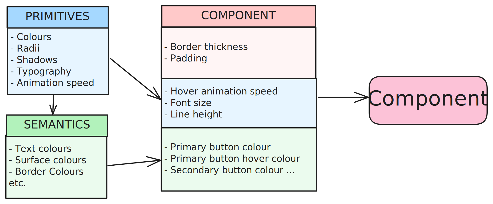

import ColorScheme from "../../../components/doc-helpers/Colorscheme.astro";
import ShowComponent from "../../../components/doc-helpers/ShowComponent.astro";
import CornerDisplay from "../../../components/doc-helpers/CornerDisplay.astro";
import ShadowDisplay from "../../../components/doc-helpers/ShadowDisplay.astro";
import TypographyDisplay from "../../../components/doc-helpers/TypographyDisplay.astro";
import AnimationDisplay from "../../../components/doc-helpers/AnimationDisplay.astro";

The styling of components is done in 3 layers:

**Primitive Variables** are core values to your components style. These will often be abstract variables, such as shades of a colour, or measurements of radius.

**Semantic Variables** have a many to one relationship with primitive variables, where a primitive variable may define multiple semantic variables. Semantic variables provide contextualised variables, such as a background colour. These aren't component specific, but help to create consistent themeing thoughout.

**Component Variables** are used to directly effect component styles. By default, many component variables will inherit their values from primitive or semantic variables. Other, non generalised properties will be defined uniquely for the component. As these are the only variable actually used by a component, any of its styles can be changed without effecting another type of component.

The relationship between primitive, semantic, and component variables allows for users to:

- [ ] Style the majority of the site by configuring the primitive variables
- [ ] Make minor, yet wide reaching tweaks through the semantic variables
- [ ] Have full control of each component type through the component variables.

By default, the package will provide all values for a theme that matches this documentation site. Any of these variable values or relationships can be reconfigured by redefining them within your main css file. Primitive and semantic varaibles are defined within this page, and component level variables are defined within their respective pages.

## Colour Schemes

Below is the default colour scheme for the site. This is already included in the CSS package and will be applied to the components by default. To start applying your custom theme, simply copy the code below into your projects CSS, and configure the values.

<ShowComponent filePath="./src/sample-css/colour.css">
  <ColorScheme />
</ShowComponent>

## Corners

As with colours, the corner styles are applied using primitive and semantic fields as shown below. These allow you to set the 'roundness' of your components.

_(If you want to achieve no rounding across all components, simply set all primitive sizes to 0px)_

<ShowComponent filePath="./src/sample-css/corners.css">
  <CornerDisplay />
</ShowComponent>

## Shadows

Shadows are defined using primitive and semantic variables. The primitive shadows provide a range of elevation levels, while semantic shadows apply these to specific UI elements.

<ShowComponent filePath="./src/sample-css/shadows.css">
  <ShadowDisplay />
</ShowComponent>

## Typography

Below are the primitive typography styles that form the foundation of our text elements.

These styles can be customized to match your brand's typography guidelines. Mobile and desktop sizes can be defined.
These will automatically get used by the default responsive sizes, which are used within the components.

<ShowComponent filePath="./src/sample-css/typography.css">
  <TypographyDisplay />
</ShowComponent>

## Animations

Animation speeds are defined using CSS variables to maintain consistency across different components. These variables control the duration of various animations throughout your project.

<ShowComponent filePath="./src/sample-css/animation.css">
  <AnimationDisplay />
</ShowComponent>
